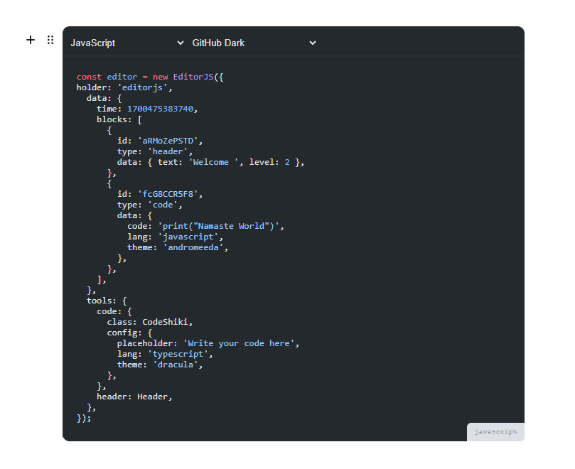

# Code Tool for Editor.js with Shiki the syntax higlighter

Code Tool for the [Editor.js](https://ifmo.su/editor) using [Shiki](https://github.com/shikijs/shiki) for syntax higlighting.

## Demo




## Installation

Install the package

```shell
pnpm add @nuxtizen/editorjs-shiki
```

## Usage

Include plugin in your application.

```js
import CodeShiki from '@nuxtizen/editorjs-shiki';
```

Add to the `tools` property of the Editor.js configuration.

```js
const editor = EditorJS({
  ...
  tools: {
    code: CodeShiki
  }

  ...
});
```
You can set the language and theme for the code block.

```javascript
const editor = new EditorJS({
  ...

  tools: {
    ...
    code: {
      class: CodeShiki,
      config: {
        lang: 'typescript',
        theme: 'dracula',
      }
    }
  }

  ...
});
```

You can find all available languages in the [Shiki Languages](https://shiki.style/languages) and themes in the [Shiki Themes](https://shiki.style/themes).

## Config Params

| Field       | Type     | Description                    |
| ----------- | -------- | -------------------------------|
| placeholder | `string` | Code Tool's placeholder string |
| lang        | `string` | Default selected language      |
| theme       | `string` | Default selected theme         |

## Output data

Example block output data:

```json
{
    "type": "code",
    "data": {
      "code": "import defaultAnimal, { person, add } from './module.js';\nimport * as Module from './module.js';",
      "lang": "javascript",
      "theme": "dracula"
    },
}
```

